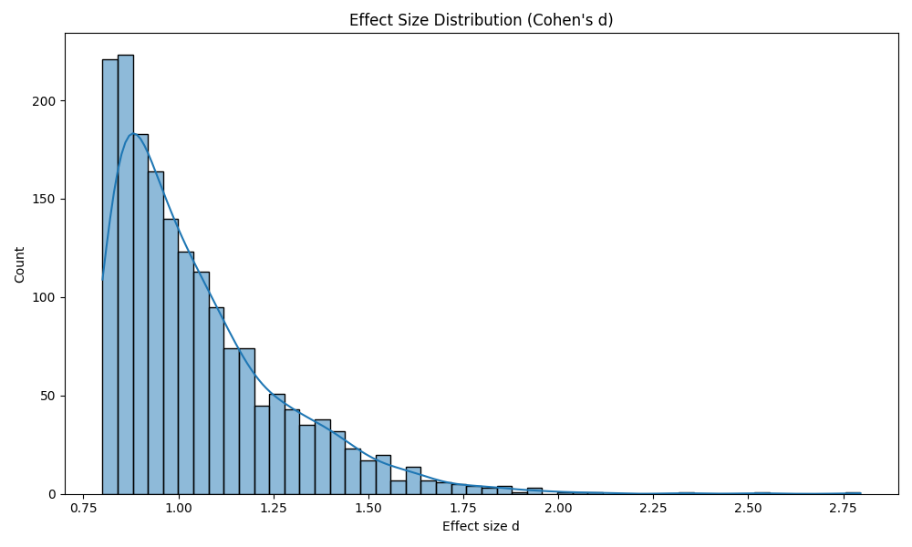
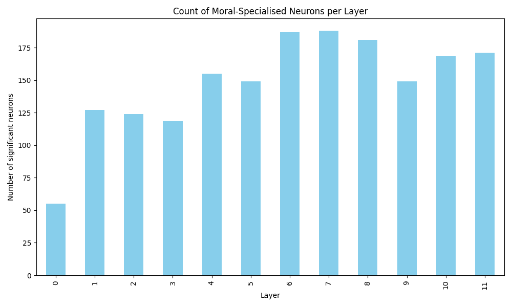
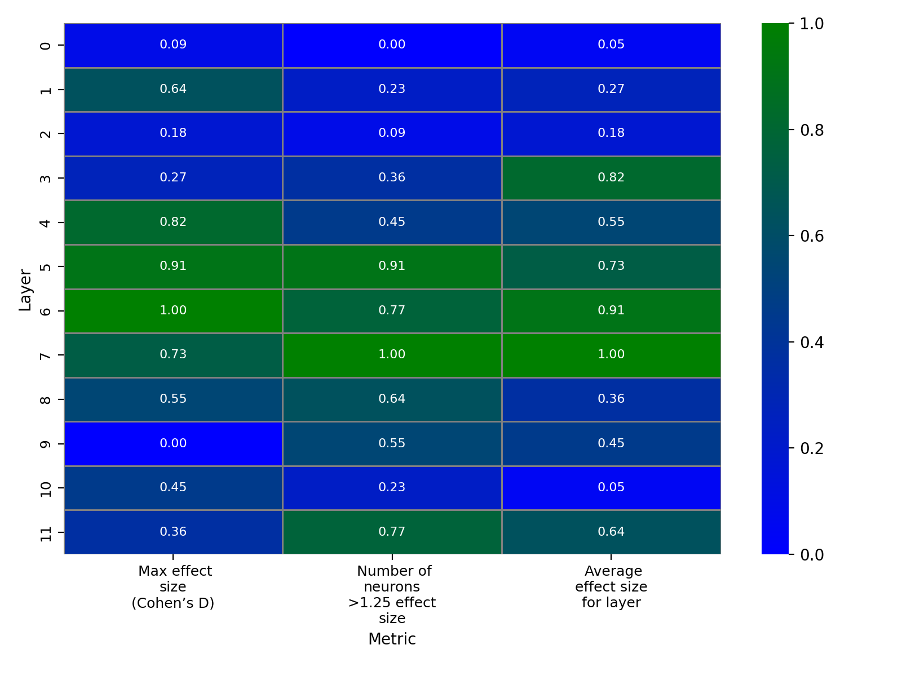
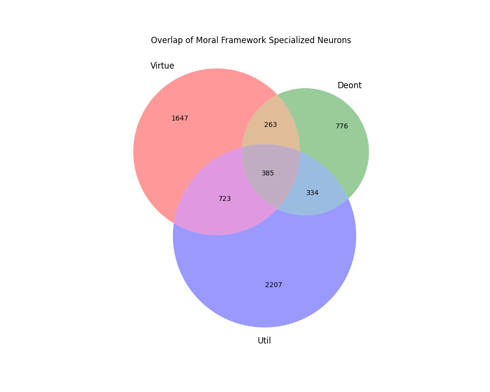
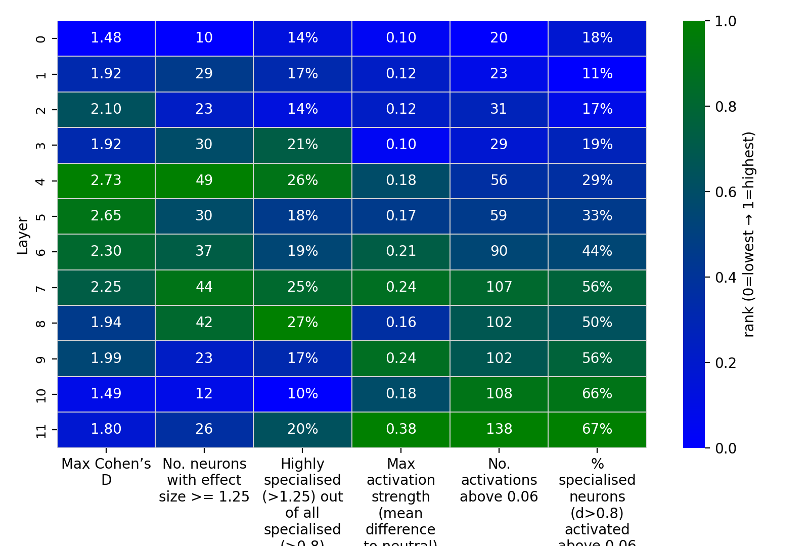
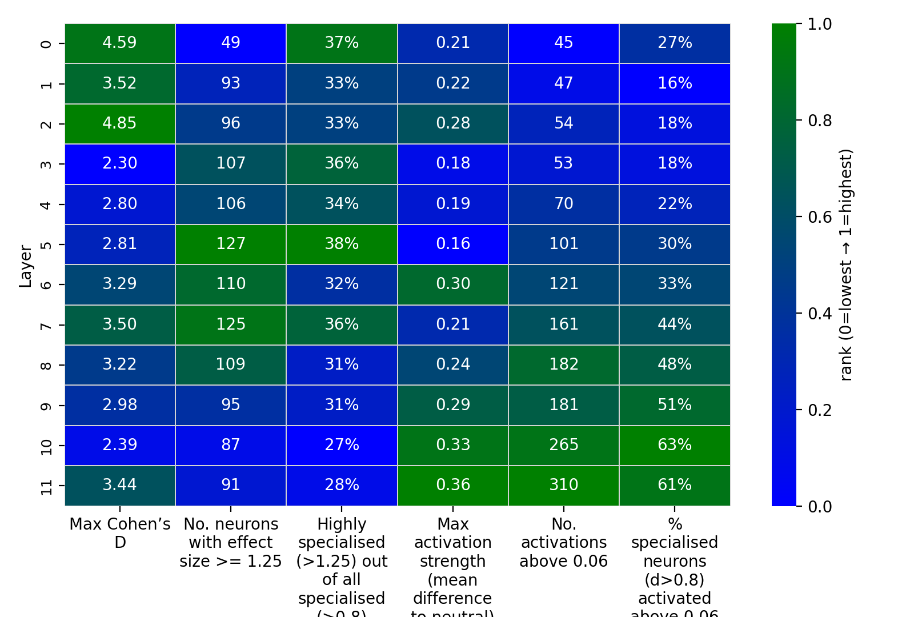

# Moral decision-making in GPT-2

## Abstract

This project uses mechanistic interpretability methods to investigate whether and how a small transformer language model (GPT‑2 small) encodes moral frameworks. Controlled moral/neutral sentence-pair datasets were constructed to target three philosophical frameworks (virtue ethics, deontology, utilitarianism), extract mean‑pooled MLP activations across all layers, and apply statistical tests to identify neurons that selectively represent moral content. Key findings show a sparse but reproducible set of morally‑selective neurons (~4–5% of MLP units), distinct layer‑wise specialisation profiles across frameworks, and evidence of some sub‑type selectivity within frameworks; causal validation via ablation remains a future step. The repository contains all code and datasets, but excludes raw activation data, due to size. Available upon request.

Author: Lauren Toulson
- Experiments: October 2025
- Write-up: January 2026

---

## Introduction

This project is an exploratory personal research study investigating whether mechanistic interpretability techniques can illuminate how small language models represent and process moral information. As contemporary AI systems increasingly produce advice, evaluations, or decisions with implicit moral consequences, it is important to understand the internal mechanisms that underlie those behaviours. My aim in this work is to explore whether interpretable structure emerges in the activations of a transformer-based model when it is exposed to moral versus non‑moral language, and to determine whether these patterns correspond to specific moral frameworks.

To make the problem tractable in this intial exploratory project, I use OpenAI’s GPT‑2 small (12 layers, 36,864 MLP neurons), which is open‑weight and computationally lightweight. The intention is to first establish whether mechanistic interpretability methods provide valid signals for basic moral distinctions, and later test whether the same patterns scale to larger, frontier‑sized models.

The exploratory research exercise is structured in three phases—Discovery, Specialisation, and Ablation — each targeting a different level of analysis.

## Study 1 - Discovery Phase

**RQ1:** Do any MLP neurons in GPT‑2 reliably increase their activation for moral stimuli versus carefully matched neutral controls?

**Sub‑Q:** At which layers are the density and magnitude of morally selective units highest?

## Study 2 - Specialisation Phase

**RQ2:** Do individual neurons selectively respond to specific moral frameworks (virtue ethics, deontology, utilitarianism) when controlling for lexical similarity?

**RQ3:** Do morally specialised neurons further divide into semantic sub‑types (e.g., pro‑social vs. internal character reasoning)?

## Study 3 - Ablation Phase (future direction)

**RQ4:** Does ablating framework‑specific neurons disrupt the model’s ability to make moral judgements, while leaving unrelated forms of reasoning unaffected?

---

# Methodology

## Dataset Construction

To isolate moral frameworks from surface‑level linguistic cues, I constructed 3 datasets of 500 moral–neutral sentence pairs. Each dataset isolated a single moral framework: Utilitarianism, Virtue ethics or Deontology. I constructed a 4th dataset combining an even sample from each moral framework. Each pair consists of:

- A moral context sentence containing reasoning grounded in one of three frameworks (virtue ethics, deontology, utilitarianism).
- A neutral context sentence matched as closely as possible in structure, length, topic, and vocabulary, but containing no moral reasoning.
- An identical decision sentence in each pair, ensuring that differences in activation reflect moral reasoning in the context — not the action itself.

Claude Opus 4.1 was used to generate these pairs using prompts that strictly enforced:

- Framework separation (e.g., no outcome‑based phrasing in deontological data).
- Lexical control (avoidance of salient moral cue‑words such as “wrong” or “virtuous”).
- Structural mirroring between moral and neutral sentences.

To validate the neutrality of the control set, I applied VADER sentiment scoring:

- Mean sentiment = 0.0037
- Median sentiment = 0
- Only 2.2% of sentences contained even moderate sentiment (|compound| > 0.25)

I manually reviewed 10% of each dataset to check for framework purity, semantic mirroring, and absence of concealed moral content.

The system prompt used to generate the datasets can be found here: [System Prompt](data/system_prompt.md)

### Example statement pairs

**Moral Framework**

- **Utilitarianism**
  - Moral Statement: She calculated that sharing the information would prevent numerous accidents. She posted the safety warning online.
  - Neutral Statement: She noticed the website had a prominent announcement section. She posted the safety warning online.

- **Virtue Ethics**
  - Moral Statement: He wanted to demonstrate integrity in his dealings. He disclosed the product defect to the customer.
  - Neutral Statement: He noticed the warranty form required all known issues. He disclosed the product defect to the customer.

- **Deontology**
  - Moral Statement: She recognized that the agreement she signed required her to disclose the information. She told her supervisor about the error.
  - Neutral Statement: She noticed the error appeared in the third column of the spreadsheet. She told her supervisor about the error.

---

## Activation Extraction

For each sentence, I extracted mean‑pooled MLP activations from all 12 layers of GPT‑2. Earlier preliminary testing revealed that using only the last token led to artificially inflated differences (many sentences end with morally loaded words). Mean‑pooling instead captures the holistic representational effect of each full sentence while avoiding token‑position bias.

This produced tensors of shape:

(500 sentences × 12 layers × 3072 neurons)

---

## Statistical Criteria for Moral Specialisation

A neuron was labelled as morally specialised if it met all three of the following criteria:

1. Statistical significance: p < 0.1 using a two‑sample Welch’s t‑test (moral vs neutral).
2. Large effect size: absolute Cohen’s d > 0.8, ensuring meaningful magnitude.
3. Directional validity: mean activation for moral sentences > neutral sentences.

This combination filters out spurious differences and ensures the identified neurons robustly encode features associated with moral content.

---

# Study 1: DISCOVERY

## Aim

Study 1 aims to determine whether GPT‑2 contains identifiable neurons whose average activation is significantly higher for moral sentences than for neutral sentences that are syntactically and lexically matched. This phase serves as a foundation: if no stable moral selectivity is found, subsequent framework‑specific analysis would be unwarranted.

To retrieve activations for this study, I used a sample of 400 moral-neutral statement pairs across the three moral frameworks.

## Study 1 Findings

### Overall Specialisation

Across 36,864 neurons, 1,774 neurons (4.81%) satisfied all criteria for moral specialisation. This indicates that:

- Moral sensitivity is real but sparse.
- GPT‑2 does not contain a single dedicated module for morality; rather, moral information is distributed across the network.
- A small subset of neurons exhibit extremely strong differences, forming a “long tail” of super‑specialised units.

The distribution is strongly right‑skewed, with a dense cluster near d = 0.8–1.0 and a long tail extending beyond d > 2.0. This suggests a spectrum of moral selectivity, from moderately tuned to highly specialised neurons.

### Layer‑wise Distribution

Moral selectivity was not evenly spread across layers:

**Key observations:**

- Mid‑layers (Layers 6–8) contained the highest density of moral‑selective neurons.
- Early layers (Layers 0–3) showed comparatively few specialised units, consistent with their role in encoding lexical and syntactic features.
- Later layers (Layers 9–11) still contained substantial numbers of specialised neurons, but with a slight decline, aligning with final‑stage representational compression before output.

This pattern suggests that moral content, like other abstract semantic properties, is processed most intensively in the intermediate representational stages of the model.

### Cross‑Layer “Circuit‑Like” Structure

Analysis of specialised neuron IDs revealed that:

- 339 neurons appeared as specialised in more than one layer.
- 6 neurons appeared in four layers, making them plausible candidates for a preliminary “morality circuit.”

Example: Neuron 2775 showed specialisation in layers 4, 5, 6, and 10.

---

# Study 2: SPECIALISATION

## Aim

Study 2 extends beyond the general moral sensitivity identified in Study 1 and asks whether GPT‑2 develops distinct internal representations for different moral frameworks. Instead of comparing “moral vs. neutral” sentences, this phase focuses on whether neurons selectively encode one moral framework—virtue ethics, deontology, or utilitarianism—when lexical and syntactic structures are carefully controlled. The goal is to determine whether the model learns genuinely differentiated internal concepts corresponding to philosophical categories.

## Datasets and Activation Extraction

To test framework‑specific selectivity, I used three datasets, each containing 500 moral–neutral statement pairs, using the same procedure as in Study 1 but constrained to one moral framework per dataset:

- Virtue ethics (500 pairs)
- Deontology (500 pairs)
- Utilitarianism (500 pairs)

Activations were extracted using mean‑pooled MLP activations across all 12 layers of GPT‑2, creating a consistent representation for downstream statistical analysis.

## Statistical Framework for Detecting Moral‑Framework Specialisation

To determine whether neurons reliably discriminate between frameworks, I applied a two‑tiered analysis:

### 1. Within‑Framework Specialisation

For each framework independently, neurons were tested for their ability to distinguish moral statements from their neutral counterparts:

- Paired t‑tests on moral vs neutral activations
- Effect size thresholds of Cohen’s d > 0.8
- Directionality requirement (moral > neutral)

This identifies neurons that encode something specific about the moral framing within each philosophical category.

### 2. Between‑Framework Specialisation

To determine selectivity between frameworks, I applied:

- One‑way ANOVA across conditions
- FDR correction (p < 0.05), controlling for simultaneous comparisons
- Post‑hoc Tukey tests to verify directional selectivity

A neuron was considered framework-specialised only if it passed both the overall ANOVA and the framework‑specific post‑hoc comparisons.

---

## Study 2 Findings

### Overlap Structure of Framework‑Specialised Neurons

A total of 6,335 neurons were specialised for at least one moral framework. Their distribution was:

- Virtue-only: 1,647
- Deontology-only: 776
- Utilitarianism-only: 2,207
- Virtue & Deontology: 263
- Virtue & Utilitarianism: 723
- Deontology & Utilitarianism: 334
- Shared across all three: 385

Several patterns emerge:

- Utilitarianism produces the largest pool of specialised neurons, suggesting that outcome‑based reasoning activates a broad, distributed computational footprint.
- Shared neurons are not neutral generalists—in most shared overlaps, the utilitarian condition drives the strongest activation.

This supports the hypothesis that even when sentences are constructed to minimise overlap, outcome‑based statements are inherently entangled with many linguistic cues, making utilitarian processing more dominant.

### Framework‑Specific Activation Profiles

To understand how selectivity manifests across depth, I analysed the layer‑wise distributions of specialised neurons and their effect sizes for each framework.

#### Deontology

**Specialisation pattern:**

- Peaks in mid‑layers (4–8), where 27–37% of specialised neurons show very strong effect sizes.
- Indicates that rule‑ and obligation‑based reasoning forms a relatively compact, abstract representation refined during the model’s middle computational stages.
- Strongest detectors: Maximum effect at Layer 4 (d = 2.73)—mid‑layers again serve as the “concept formation zone.”
- Activation strength: As with all frameworks, activation strength increases sharply in later layers (9–11).

By Layer 6, 43–54% of specialised deontological neurons are “loud” (activation > 0.06), suggesting the model amplifies rule‑based signals toward the output.

#### Virtue Ethics

**Specialisation pattern:**

- Concentrated in layers 6–10, with highest percentages in layers 6–8 (40%, 37%, 34%).
- This mirrors deontology but shifts slightly later, implying that virtue ethics—which often concerns character and internal motivations—requires deeper integration and contextualisation.
- Strongest detectors: The highest effect size occurs in Layer 11 (d = 4.57).
- Activation strength: Same late‑layer amplification as other frameworks.

By Layer 6, nearly half of all specialised virtue neurons exceed the activation threshold.

#### Utilitarianism

**Specialisation pattern:**

- Evenly distributed across all layers, staying within 27–38% of specialised neurons from layers 0–11.
- This suggests that outcome‑based reasoning is a distributed computation, emerging at every representational depth rather than being refined in a specific region.
- Strongest detectors: Surprisingly, the largest effect sizes occur in very early layers, peaking in Layer 2 (d = 4.85).
- Activation strength: Late‑layer amplification is again present (Layers 9–11).

This indicates that utilitarian signals can be detected from shallow lexical or semantic features—e.g., references to consequences (“help,” “many,” “reduce,” “impact”).

---

## Interpretation and Response to RQ2

Analysis for RQ2 provides strong evidence that GPT‑2 develops differentiated internal structure for distinct moral frameworks.

1. Evidence for Framework‑Based Specialisation

The presence of large sets of framework-exclusive neurons (e.g., 2,207 for utilitarianism alone) shows that GPT‑2 forms distinct representations for each type of moral reasoning, rather than relying on a single “morality neuron” or homogeneous circuit.

2. Evidence for Selective Preference Among Shared Neurons

Neurons active in multiple frameworks generally exhibit a preference, firing more strongly for one framework. This indicates competitive or hierarchical encoding rather than generic moral processing.

3. Evidence for Distinct Processing Pathways

The three moral frameworks produce qualitatively different layer‑wise profiles:

- Deontology: Mid‑layer conceptual refinement
- Virtue ethics: Deeper abstraction, late‑layer synthesis
- Utilitarianism: Distributed features with early detection

These differences strongly suggest that GPT‑2 employs different computational strategies to represent different moral frameworks.

---

# RQ3: Sub‑Specialisation Within Moral Frameworks

## Aim

While RQ2 established that GPT‑2 forms distinct neural representations for different moral frameworks, RQ3 investigates a deeper question: within a given moral framework, do individual neurons specialise even further, responding selectively to semantic sub‑types such as pro‑social behaviour, internal character reasoning, rule‑based obligations, or community‑level consequences?

This analysis tests whether moral representation in GPT‑2 shows fine‑grained structure in response to distinct moral themes or whether moral concepts are more broadly encoded.

## Methodology

### Neuron Selection

To examine potential sub‑specialisation, I focused on framework-exclusive neurons—those specialised (FDR‑corrected p < 0.05, Cohen’s d > 0.8) for only one moral framework, as determined in RQ2. For each framework separately, I extracted two complementary sets of candidate neurons:

- Top 10 High‑Precision Detectors
  - Neurons with the largest Cohen’s d (moral vs neutral)
  - Represent the most statistically reliable framework detectors

- Top 10 High‑Output Activators
  - Neurons with the largest mean activation difference (moral – neutral)
  - Capture neurons that may drive strong output‑relevant signals regardless of effect size

These two groups allow differentiation between neurons that are exceptionally specific and those that are exceptionally influential.

For each selected neuron, I then computed the activation difference for every statement pair in its framework dataset.

### Qualitative Sub‑Type Analysis

To determine whether neurons were more responsive to certain semantic themes, I employed a two‑stage qualitative analysis:

1. Automated word‑frequency pass:
   - Identified the top 50 words across all statements in the framework
   - Counted how many times these words appeared in:
     - the top 25 highest‑activating statements for the neuron
     - the bottom 25 lowest‑activating statements
   - Used these distributions to identify candidate semantic themes (e.g., regulatory language, pro‑social phrasing, collective benefit).

2. Manual thematic coding:
   - Reviewed the top and bottom statements to classify them by emergent semantic themes
   - Assessed whether a neuron consistently fired more strongly for a particular sub‑type within its framework
   - Categorised neurons as:
     - Sub‑type selective (clear thematic distinction)
     - Lexical/phrasing detectors (activation driven by repeated formulations)
     - Generalists (no meaningful sub‑type distinction)

This mixed‑method approach enabled interpretation of neuron behaviour beyond raw effect sizes.

## Findings

### Deontology

#### High‑Precision Neurons

- Neuron 475 — Layer 2 (d = 2.10)
  - Demonstrated clear sub‑specialisation. It responded more strongly to statements involving explicit laws, formal policies, and binding agreements, and less strongly to statements involving softer obligations such as promises or best‑practice guidelines.
  - Interpretation: Early‑layer detection of formal, rule‑based language.

- Neuron 2555 — Layer 9 (d = 1.99)
  - Showed no consistent thematic distinction. Activation patterns aligned more with repeated lexical phrasing than with substantive moral sub‑types.
  - Interpretation: Likely detecting surface cues rather than conceptual differences.

#### High‑Output Neurons

- Neuron 896 — Layer 11 (diff = 1.02)
  - Slight preference for statements involving external, regulatory obligations over personal or internalised duties.
  - Interpretation: Late‑layer amplification of explicit institutional rules.

- Neuron 974 — Layer 11 (diff = 1.61)
  - Fired most strongly for statements referencing binding legal requirements and notably less for general moral duties.
  - Interpretation: A sub‑type detector for formalised constraints, consistent with deontology’s emphasis on rule‑based action.

### Virtue Ethics

#### High‑Precision Neurons

- Neuron 1426 — Layer 6 (d = 3.0)
  - Differentiated between pro‑social, outward‑facing virtuous acts and more introspective, self‑development‑focused statements.
  - Interpretation: A genuine sub‑type distinction between externally manifested virtue and internal character cultivation.

- Neuron 625 — Layer 10 (d = 2.97)
  - Showed only mild thematic differentiation, with somewhat greater activation for statements involving emotional or relational effort. However, patterns were not strong enough to classify this neuron as clearly sub‑type selective.
  - Interpretation: Broadly tuned to virtue‑ethical content rather than specific sub‑domains.

#### High‑Output Neurons

- Neuron 582 — Layer 9 (diff = 0.28)
  - Displayed a strong split between statements emphasising actively demonstrating virtue (“being the kind of person who…”) and statements focused on competent task completion.
  - Interpretation: Likely a detector for performative virtue—how individuals outwardly express virtuous character.

- Neuron 764 — Layer 11 (diff = 0.27)
  - Activation was driven overwhelmingly by phrases like “wanted/sought/aimed to be someone who shows…”
  - Interpretation: A lexical‑pattern neuron rather than a conceptual sub‑type detector.

### Utilitarianism

#### High‑Precision Neurons

- Neuron 925 — Layer 2 (d = 4.85)
  - Strongly preferred statements describing broad, systemic reforms (e.g., community‑wide or infrastructural improvements) over localised, individual‑level benefits.
  - Interpretation: A sub‑type detector distinguishing macro‑level from micro‑level consequential outcomes.

- Neuron 676 — Layer 0 (d = 4.5)
  - Activated for statements emphasising collective benefit, equity, and accessibility (e.g., improving conditions for diverse populations).
  - Interpretation: Detects early‑stage cues relating to fairness‑oriented utilitarian outcomes.

#### High‑Output Neurons

- Neuron 2265 — Layer 10 (diff = 0.33)
  - Showed clear selectivity for systematic, infrastructure‑level improvements—especially environmental or economic efficiency.
  - Interpretation: An amplifier of large‑scale, quantifiable outcome reasoning.

- Neuron 625 — Layer 9 (diff = 0.29)
  - Fired more strongly for statements about reducing inequality and ensuring universal access to essential services.
  - Interpretation: A detector for distributive‑justice sub‑themes within utilitarian reasoning.

## Interpretation and Response to RQ3

Study 3 provides evidence that some framework‑specific neurons in GPT‑2 exhibit meaningful sub‑type selectivity within their respective moral frameworks. However, this pattern is not universal:

- Clear sub‑specialisation was found in several neurons across all three frameworks—e.g.,
  - Deontological “hard law” detectors
  - Virtue‑ethical pro‑social action detectors
  - Utilitarian macro‑ vs micro‑level outcome detectors
- Other neurons acted as lexical or phrasing detectors, indicating that some apparent specialisation derives from stylistic regularities rather than conceptual differences.
- Some neurons remained broad generalists, responding reliably to the framework but not to specific sub‑domains.

Overall, these findings suggest that GPT‑2 encodes moral frameworks in a structured but heterogeneous manner:

- Framework-level distinctions are robust and widely distributed,
- But fine-grained semantic sub‑types emerge only sparsely,
- Reflecting a mix of conceptual and superficial cues in the model’s internal moral representations.

---

# Study 3: ABLATION (Future Work)

## Aim

The ablation phase was designed to test the causal validity of the specialised neurons identified in RQ1–RQ3. While Studies 1 and 2 revealed statistically robust patterns of neural selectivity, these analyses alone cannot establish whether the identified neurons functionally contribute to moral decision-making. Causal evaluation—typically via targeted ablation—is essential to determine whether these neurons merely correlate with moral content or whether they play a meaningful role in the model’s decision‑making pathways.

This phase remains incomplete, but represents the most important avenue for future work.

## Intended Evaluation Design

The original plan was to ablate sets of framework‑specific neurons (e.g., virtue‑only, utilitarian‑only, top “super‑neurons”) and observe whether these interventions degraded GPT‑2’s performance on moral judgement tasks. To test this, I generated an evaluation dataset composed of:

- Yes/no moral judgement questions derived from the original statement pairs
- Neutral control questions to verify specificity
- Positive and negative formulations (“Should he disclose…?” / “Should he conceal…?”)

The ablation itself was implemented as zero‑ablation during the forward pass: setting the target neurons’ activations to zero and measuring the change in output logits relative to the non‑ablated baseline.

## Practical Challenges and Attempted Solutions

Despite careful dataset construction, several practical obstacles prevented the ablation phase from being executed reliably:

1. GPT‑2 struggled to answer yes/no questions directly

   Initial tests revealed that GPT‑2 small rarely produced high‑probability “Yes” or “No” tokens when queried in isolation. Even clearly factual questions elicited extremely low probabilities for both options, with the model instead continuing the sentence or defaulting to generic continuations.

2. Few‑shot prompting improved format adherence but not model neutrality

   Adding in-context examples (e.g., “Question: … Answer: Yes”) improved grammatical form but introduced a strong yes‑bias—the model defaulted to “Yes” even for nonsensical or obviously “No” questions. Increasing the number of negative examples did not meaningfully reduce this effect.

3. Reformulating the task as multiple‑choice produced mixed results

   Switching to an A/B preference format (e.g., Option A: moral choice, Option B: immoral choice) allowed the model to give consistent answers, but revealed another problem:

   When the model was incorrect, the log‑probabilities for both options were extremely low and unstable.

   This made it difficult to reliably quantify degradation after ablation.

4. Task-specific biases may overshadow subtle activation changes

   Because GPT‑2 is not instruction‑tuned and lacks a stable moral judgement schema, its behaviour in the evaluation task appears dominated by training priors rather than sub-network structure. As a result, even well‑constructed questions did not produce sufficiently clean behavioural baselines to measure causal effects.

## Interpretation and Future Directions

Without causal testing, findings in RQ1-3 remain correlational: the specialised neurons identified may encode moral content, but we cannot yet determine whether they drive the model’s moral representations.

To progress, future work should focus on:

- Developing a more reliable behavioural evaluation task, possibly using forced-choice completions rather than yes/no classification
- Implementing stronger prompting strategies, or performing ablation on a lightly instruction‑tuned variant of GPT‑2 to stabilise output behaviour
- Exploring circuit-level interventions (e.g., path patching) alongside neuron-level ablation for deeper causal inference
- Testing ablation of shared “general moral neurons” vs. framework‑exclusive neurons to validate the representational hierarchy observed in RQ2–RQ3
- Repeating experiments in RQ1-3 on a frontier model then conducting ablation testing. Major challenges with evaluation of GPT-2 may stem from the simplicity of the model. A frontier model may be more capable of producing appropriate outputs in evaluation.

---

## Limitations

- Lexical confounds: some keywords associated with specific frameworks (e.g. "obligated") were more common in single‑framework datasets and may drive apparent neural selectivity independent of deeper conceptual representations.
- Neutrality: no natural language statement can be guaranteed perfectly neutral. We validated neutral controls with VADER (mean ≈ 0.0037; only ~2.2% |compound| > 0.25), but residual biases may still influence results.
- Model and generalisability: experiments use GPT‑2 small; representational patterns and evaluation behaviour may differ in larger or instruction‑tuned models.
- Measurement constraints: choices such as pooling strategy, statistical thresholds (p, Cohen’s d), and parsing/formatting decisions affect sensitivity and false positive rates; causal claims require targeted interventions (e.g. ablation or path‑patching).

---
Acknowledgements: I would like to thank my colleauges at the AI Security Institute, Vanessa Cheung and Kata Slama, for their feedback on this project.

Disclaimer: This is a personal project and not associated with my work at the AI Security Institute.